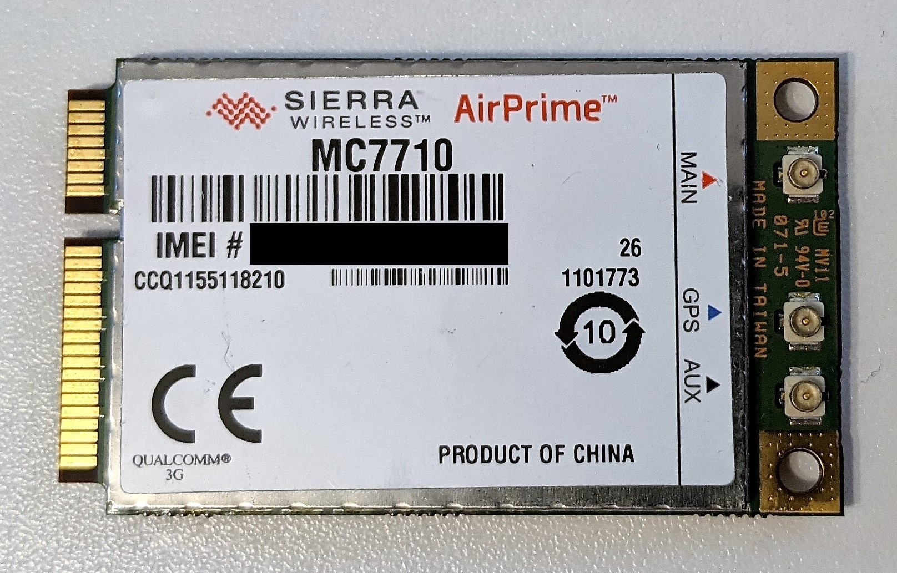
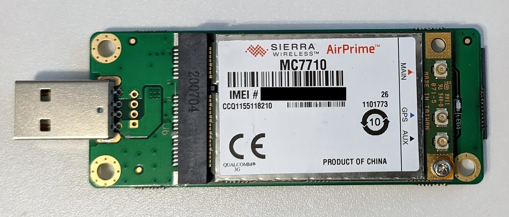

# LTE/4G support for X230 and T430 using a Sierra MC7710 WWAN Card

If you find this useful, consider to buy me a coffee, either by clicking  or clicking the ❤ Sponsor button on the top 🔝

## Problem statement

Early July 2021 the 3G networks in Germany got turned off. 2G will be kept running but with the officially supported WWAN card (Ericsson H5321gw) this left my X230 and T430 with EDGE speed 😐

After some research I figured out that the Sierra MC7710 WWAN card supports LTE/4G and is also supported by the X230 and T430, although not offically listed as such. It turned out a bit of a journey to get it working and this document contains all steps needed to get it working yourself on a X230 or T430 running Windows 10.

## What you'll need

* A screwdriver
* [X230](https://thinkpads.com/support/hmm/hmm_pdf/x230_x230i_hmm_en_0b48666_01.pdf) or [T430](https://thinkpads.com/support/hmm/hmm_pdf/t430_t430i_hmm_en_0b48304_03.pdf) maintenance manual
* Sierra MC7710 WWAN Card
    * 
    * I found both used in my notebooks on ebay for around 30 EUR (July 2021)
* A working machine to plug the Sierra MC7710 into + a Linux USB-Bootdrive if that machine isn't running Linux
    * Could be another notebook that simply accepts the card 🤷‍♂️
    * I also tried a Mini PCIe to PCIe card for my workstation, which turned out to be mechanically incompatible with the Sierra MC7710. The lower side of the Sierra MC7710 is equipped too and did not fit due to some distance spacer.
    * Finally I ended up using a USB to Mini PCIe adapter built for use in industrial machines
        * [EXVIST 4G LTE Adapter on Amazon](https://www.amazon.de/gp/product/B08B88L4PL/), around 15 EUR (July 2021)
        * 
        * Before buying an adapter, read the next section first!

## BIOS whitelist

If you got a Sierra MC7710 give it a trial first and install it in your ThinkPad. Maybe you are lucky, according to some sources in the web, occasionally one gets one that works out-of-the-box. I read a rumor that Lenovo whitelisted them in the BIOS for some big customer but never promoted it publically and maybe you got one of these that are preconfigured correctly. If so, feel lucky 🎉 and jump directly to section [Installing drivers under Windows](#installing-drivers-under-Windows), everybody else will get a few beeps during boot and a error message greating you:

    1802: Unauthorized network card is plugged in - Power off and remove the miniPCI network card (1199/68A3).
    
    System is halted

Now you need to get one of the adapters or consider another machine. From here on, I assume you got an adapter.

## Rewriting part ID of the WWAN card

I assume some basic Linux knowledge. You probably don't need a Linux machine, a Linux USB-Bootdrive should do the job too. You may even use your ThinkPad for this.

1. Plug in the USB Adapter with the Sierra MC7710 installed
2. Run `dmesg` and you should see something like this at the end to confirm that the Sierra MC7710 got detected. You also see that the adapter got attached to a series of ttyUSB devices

    > [802233.364885] usb 1-4: new high-speed USB device number 49 using xhci_hcd  
    > [802233.514400] usb 1-4: config 1 has an invalid interface number: 7 but max is 5  
    > [802233.514404] usb 1-4: config 1 has no interface number 5  
    > [802233.515974] usb 1-4: New USB device found, idVendor=1199, idProduct=68a3, bcdDevice= 0.06  
    > [802233.515979] usb 1-4: New USB device strings: Mfr=3, Product=2, SerialNumber=4  
    > [802233.515982] usb 1-4: Product: MC7710  
    > [802233.515984] usb 1-4: Manufacturer: Sierra Wireless, Incorporated  
    > [802233.515987] usb 1-4: SerialNumber: 358178043472549  
    > [802233.557967] usbcore: registered new interface driver usbserial_generic  
    > [802233.557974] usbserial: USB Serial support registered for generic  
    > [802233.559144] usbcore: registered new interface driver sierra  
    > [802233.559150] usbserial: USB Serial support registered for Sierra USB modem  
    > [802233.559165] sierra 1-4:1.0: Sierra USB modem converter detected  
    > [802233.559501] usb 1-4: Sierra USB modem converter now attached to ttyUSB0  
    > [802233.559526] sierra 1-4:1.1: Sierra USB modem converter detected  
    > [802233.559774] usb 1-4: Sierra USB modem converter now attached to ttyUSB1  
    > [802233.559788] sierra 1-4:1.2: Sierra USB modem converter detected  
    > [802233.560076] usb 1-4: Sierra USB modem converter now attached to ttyUSB2  
    > [802233.560094] sierra 1-4:1.3: Sierra USB modem converter detected  
    > [802233.560362] usb 1-4: Sierra USB modem converter now attached to ttyUSB3  
    > [802233.560379] sierra 1-4:1.4: Sierra USB modem converter detected  
    > [802233.560657] usb 1-4: Sierra USB modem converter now attached to ttyUSB4  
    > [802233.568616] sierra_net 1-4:1.7 wwan0: register 'sierra_net' at usb-0000:00:14.0-4, Sierra Wireless USB-to-WWAN Modem, fa:93:a1:9d:01:07  
    > [802233.569596] usbcore: registered new interface driver sierra_net  
    > [802233.584730] sierra_net 1-4:1.7 wwxfa93a19d0107: renamed from wwan0  

3. Now we need to send a series of AT commands to the modem to rewrite the part ID
    * If you have no clue what that is, read the [Wikipedia article](https://en.wikipedia.org/wiki/Hayes_command_set) on it. In short, it is some ancient commands from 1981 that are still supported in today's modems. Some tech doesn't age 🤷‍♂️
    * To not require using telnet, putty or whatsoever, I am using https://github.com/beralt/atinout in the following to send the AT commands to the Sierra MC7710. Clone the repository and build the `atinout` executable.
        * If you have no clue on git, make or how to install packages under Linux, you may need to read a bit up on this
4. Now we figure out which of the ttyUSB devices is the modem by sending just the `AT` command. You probably need to drop into a root shell using `sudo -s` first. Then run `echo 'AT' | atinout - /dev/ttyUSB0 -` and increment the last character until you get an `OK` response back. In my example this was ttyUSB3 and a succesfull response looks like this:

    > `[user@host] $ echo 'AT' | atinout - /dev/ttyUSB3 -`
    >  
    > `OK`

5. Now we run a series of AT commands to first unlock the device, receive a list of allowed part IDs, reset the part ID, then reboot the modem. Each successfull command is responded with a `OK`.

    1. This command unlocks the device with the vendor default password A710

        > `[user@host] $ echo 'AT!ENTERCND="A710"' | atinout - /dev/ttyUSB3 -`
        >  
        > `OK`  

    2. This command receives a list of valid UDPID values, if you are not receiver any results, try the next ttyUSB device the device. For me two did respond to the AT and accepted the password but only one returned a non-empty result on this one

        > `[user@host] $ echo 'AT!UDPID=?' | atinout - /dev/ttyUSB3 -`
        >  
        > `68A3`  
        > `68AA`  
        > `68A2`  
        > `68B1`  
        > `68A9`  
        >
        > `OK`  
        
    3. This command sets the UDPID to a value that's whitelisted in the BIOS

        > `[user@host] $ echo 'AT!UDPID=68A2' | atinout - /dev/ttyUSB3 -`
        >  
        > `OK`  
    
    4. This command reboots the modem - give it a few seconds before continuing with the next step

        > `[user@host] $ echo 'AT!RESET' | atinout - /dev/ttyUSB3 -`
        >  
        > `OK`  

6. If you run `dmesg` again you should see similar output as before once the device has rebootet.
7. You are done here. Remove the USB adapter, install the card in your ThinkPad and boot into Windows.

## Installing drivers under Windows

1. Get the latest driver on the [Sierra Website](https://source.sierrawireless.com/devices/mc-series/mc7710/). Unfortunatelly you'll need to register to download the driver. I used Windows Driver version 5087.
2. Now open a command prompt with admin permissions and go to the folder you downloaded the driver into. Rund the following command with all extra parameters to install the driver. The regular GUI installer will launch afterwards. Note: Without the parameters, I did not get the card working properly!

    > `GenericDriverSetup_5087.exe WIN8BUSDriver=1 USBCOMP=8 DisableUsbCompAutoUpdate=1 GPS=1 GPSAUTO=1`

3. Reboot your machine.
4. The card should work now with the built-in Windows functionality! 🎉
5. Suggestion: In the Microsoft Store search for `Skylight`, an app provided by Sierra. It's a nice small application that shows you the cell status 2G or 4G, as well as allows to read or send SMS, plus a few other features.
6. Suggestion: If you previously had a Ericsson H5321gw installed, uninstall the `Mobile Broadband Driver v8.2.5` from Lenovo under installed programms.

## References and Credits

This guide would not have been possible with leveraging some other sources.

* First of all the folks at [thinkpad-forum.de (general thread on X230 with LTE card)](https://thinkpad-forum.de/threads/181957-X230-Sierra-Wireless-MC7710-3G-4G-LTE-HSPA-GPS-f%C3%BCr-T430-X230-von-ebay/page2) that gave me the idea for it and prooved it worked.
* Then the earlier mentioned https://github.com/beralt/atinout project that saved me lots of time.
* Lastly, user falafel at [thinkpad-forum.de (thread on X230 with Sierra MC7710)](https://thinkpad-forum.de/threads/227949-Sierra-MC7710-mit-68A2) with the right command to get the windows driver working properly.

Thanks to all of you! You made my X230 and T430 enjoying the speed of LTE 😀
